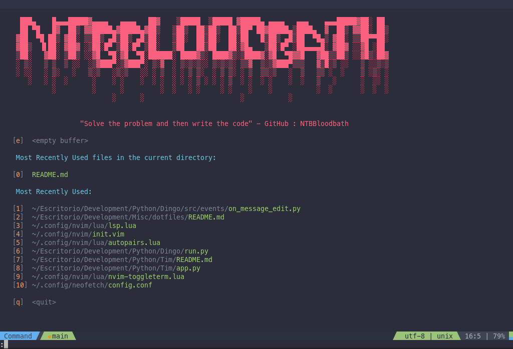
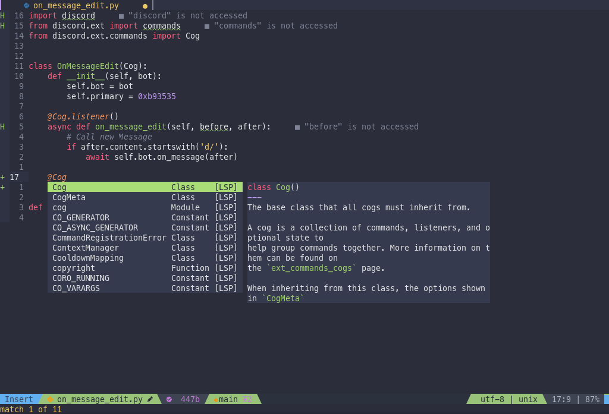

# Dotfiles

These are my personal dotfiles for my GNU/Linux
and Termux development environments.

## Content

- Wallpapers
- Installation of packages
  - Languages
  - ZSH
  - Tools
- Configurations
  - Git
  - ZSH
  - Neovim (nightly!)
  - SpaceVim (for neovim 0.4)
  - lsd
  - Termux

### Installing

Clone the repository and run the installation
script inside the scripts folder.

> NOTE: You must run the installation script
> while inside the scripts folder!

### Neovim

My setup for Neovim (nightly only) is made with performance and ease in mind and inspired by [SpaceVim](https://spacevim.org/). Currently it only contains LSPs for JS/TS and Python.

In the future I will change the init.vim for an init.lua to have better compatibility with the plugins made in lua.

|                Neovim Start Screen                 |             Pyright in action              |
| :------------------------------------------------: | :----------------------------------------: |
|  |  |

> Notes:
>
> 1. If you want to use it to develop in other language, check [CONFIG.md](https://github.com/neovim/nvim-lspconfig/blob/master/CONFIG.md) from the nvim-lsp repo.
>
> 2. You can change manually the header and the message by modifying the [init.vim](./nvim/init.vim)
>
> 3. You can see the keybindings by pressing the Space key, like SpaceVim.

---

### Wallpapers

|                    Clang Anime Girl                    |               Nordic               |                   Cyberpunk 2077                   |
| :----------------------------------------------------: | :--------------------------------: | :------------------------------------------------: |
|  |  |  |

> All the credits of the images go to their authors (I don't know what they are).
