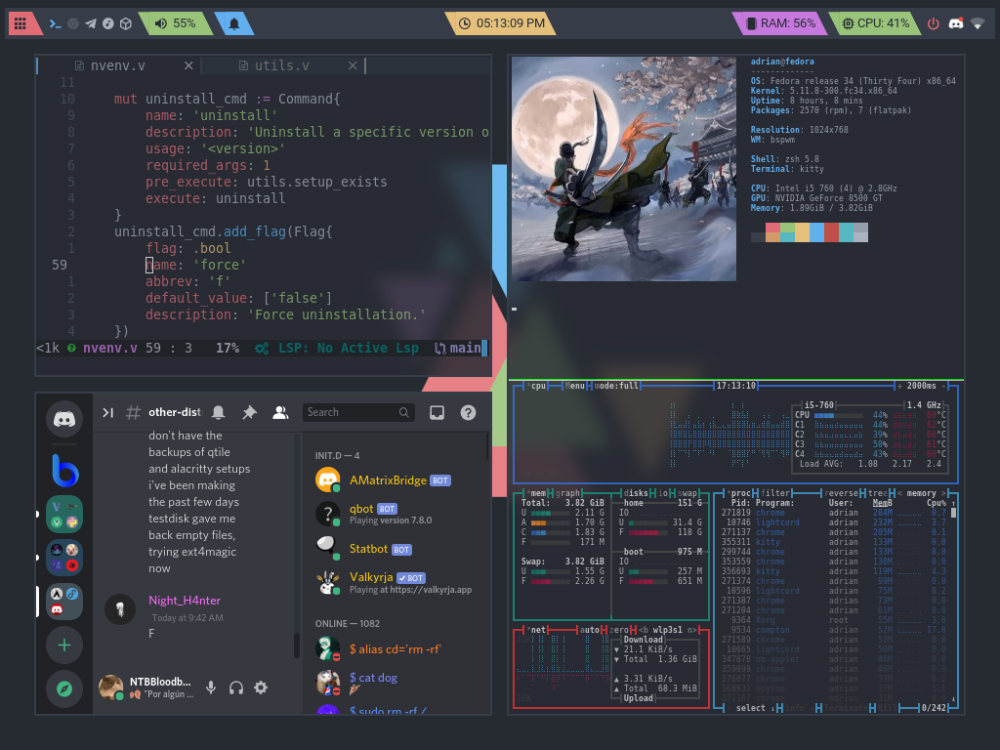

    <h1>Dotfiles</h1>
    

        These are my personal dotfiles for my GNU/Linux
        and Termux development environments.
    

    

> Much of my setup uses the onedark color scheme.

## Content

> **NOTES:**
> 
> 1. The bspwm setup has some extra dependencies, see its configuration.
>
> 2. You can also change kwallet in bspwm for another keyring service if you don't
> use KDE as your DE.
> 
> 3. I'm using pipewire instead of pulseaudio but the pavolume script of my polybar _should_ work as expected with pulseaudio too.

- Environment setup
  - Wallpapers
  - Configurations (dynamic colors using pywal)
    - bspwm + [bsp-layout](https://github.com/phenax/bsp-layout)
    - dunst
    - polybar
    - rofi
    - sxhkd
    - compton (I'm too lazy to switch to picom)
- Other configurations
  - Shells
    - ZSH (for oh-my-zsh, searching for other manager)
  -  Editors (yes, I use Neovim and Emacs ...)
    - Neovim (Doom Nvim, requires Neovim nightly)
    - Emacs (Doom Emacs)
  - Terminal tools
    - bat
    - lsd
    - htop
    - bpytop
    - neofetch
  - Termux

### Installing

Clone the repository and copy the directories to their proper location,
nothing more.

### Neovim

I use [Doom Nvim](https://github.com/NTBBloodbath/doom-nvim) as my daily use
setup for Neovim (Neovim nightly required).

---

### Wallpapers

|                    Clang Anime Girl                    |               Nordic               |                   Cyberpunk 2077                   |
| :----------------------------------------------------: | :--------------------------------: | :------------------------------------------------: |
|  |  |  |

> All the credits of the images go to their authors (I don't know what they are).
>
> You can find more wallpapers at [wallpapers directory](./wallpapers)
