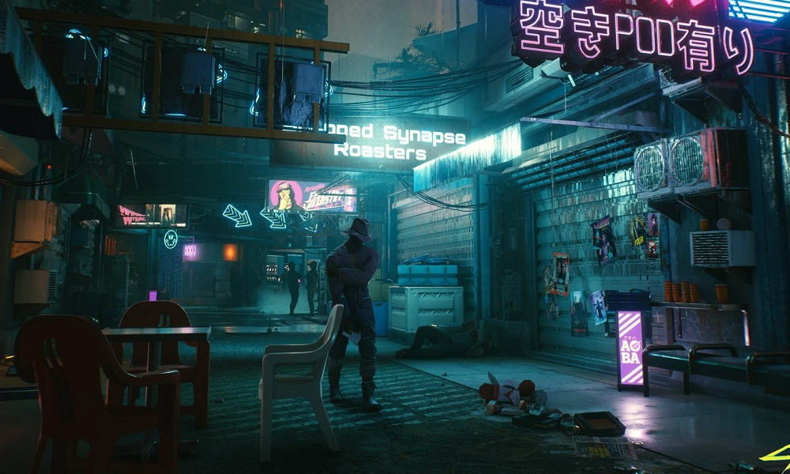

# Dotfiles

These are my personal dotfiles for my GNU/Linux
and Termux development environments.

## Content

- Wallpapers
- Installation of packages
  - Languages
  - ZSH
  - Tools
- Configurations
  - Git
  - ZSH
  - SpaceVim (for neovim 0.4)
  - lsd
  - Termux

### Installing

Clone the repository and run the installation
script inside the scripts folder.

> **NOTE:** You must run the installation script
> while inside the scripts folder!

### Neovim

My setup for Neovim (nightly only) is made with performance and ease in mind and inspired _a bit_ by [SpaceVim](https://spacevim.org/).

> See [Nvlood](https://github.com/NTBBloodbath/nvlood) for more details.

---

### Wallpapers

|                    Clang Anime Girl                    |               Nordic               |                   Cyberpunk 2077                   |
| :----------------------------------------------------: | :--------------------------------: | :------------------------------------------------: |
|  |  |  |

> All the credits of the images go to their authors (I don't know what they are).
